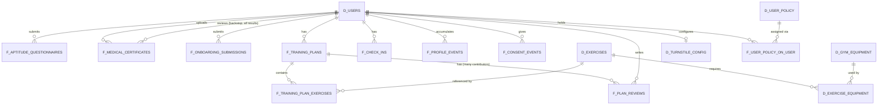

# Data Model

Target: PostgreSQL, defined via Drizzle schema. This document describes entities conceptually; exact Drizzle table/column syntax is an implementation detail derived from this.

Tables follow a fact/dimension prefix convention: **`d_`** for dimension tables (relatively static reference/master data describing a *who* or *what*) and **`f_`** for fact tables (events, transactions, or measurable occurrences, each tied to a point in time). See `rules/naming-conventions.md`. This is a distinction of **grain and change-frequency, not mutability** - a fact row can be (and sometimes is) updated in place; it just tends to change or accumulate far more often than a dimension row does.

## 1. Entity-Relationship Overview

## 2. Tables

### `d_users`
Single table for every person in the system - member, trainer, or admin alike. There is **no `role` column and no separate per-role profile table**; what a user can do is entirely determined by their active policy grants (`f_user_policy_on_user` → `d_user_policy`, see below), and which of the columns below are populated depends on what kind of person they are (see notes per column).
| Column | Type | Notes |
|---|---|---|
| id | uuid PK | |
| email | text, unique | Signup looks up an existing incomplete row by this value before creating a new one (FR-1) |
| phone | text, nullable | |
| password_hash | text, nullable | Null until aptitude clearance (FR-9); no login possible before it's set |
| name | text | |
| birthdate | date, nullable | Only ever populated for a member |
| gender | enum(`female`,`male`,`prefer_not_to_say`), nullable | Optional (FR-45); only ever populated for a member who chose to answer |
| reference_photo_path | text, nullable | Server-side only (uploads volume); audit/recompute source, never served to the kiosk or any client. Only ever populated for a member |
| reference_face_embedding | jsonb (float array), nullable | The only biometric artifact distributed outward, via the kiosk embeddings endpoint (FR-31). Only ever populated for a member |
| aptitude_status | enum(`pending`,`cleared`,`rejected`), nullable | Final state after the questionnaire/certificate/admin-override flow resolves. Only ever populated for a member - a seeded trainer/admin account is never subject to this gate (FR-44). A `rejected` row is permanent (FR-8) - its e-mail can never be reused for a new signup |
| membership_status | enum(`active`,`inactive`), nullable | Mocked, no billing logic behind it. Only ever populated for a member |
| membership_plan | text, nullable | Mocked plan tier label. Only ever populated for a member |
| created_at | timestamp | |
| updated_at | timestamp | |

Trainer/admin rows are created only by the seed script (FR-41) - there is no application code path that inserts a `d_users` row and grants it staff-designated policies other than that seed, or the Admin policy-management feature (FR-43) acting on an *existing* row.

### `f_consent_events`
Records each LGPD consent a member has given (FR-46, RN-12). Append-only: a new consent (a re-worded
policy, for example) is a new row, never an edit to an old one - the point is to be able to prove what
was agreed to and when, not just what is true now.
| Column | Type | Notes |
|---|---|---|
| id | uuid PK | |
| user_id | uuid FK → d_users.id | |
| consent_type | text | e.g. `biometric_facial` - the only type this project defines today |
| consent_version | text | Identifies which wording of the consent text was shown |
| consented_at | timestamp | |

### `d_user_policy`
One row per granular, independently-grantable permission - the building block CASL abilities are constructed from. **Add-mostly**: policies are seeded/added over time; an existing one shouldn't be deleted once any `f_user_policy_on_user` row references it, for the same reason `d_exercises` is add-only.
| Column | Type | Notes |
|---|---|---|
| id | text PK | Human-readable slug matching the policy's purpose, e.g. `manage_onboarding`, `read_aptitude` - not a random uuid, since it's referenced directly as a stable identifier in code (`packages/shared/src/auth/constants/policies.ts`) |
| description | text | Human-readable explanation, shown in the Admin policy screen (FR-43) |
| operation | text | CASL action: `create` \| `read` \| `update` \| `delete` \| `manage` |
| resource | text | CASL subject type the operation applies to, e.g. `TrainingPlan`, `MedicalCertificate`, `Catalog`, `UserPolicyAssignment`, `MemberApp`, `StaffApp` |
| scope | text | `self` \| `all` - whether the operation applies only to the acting user's own records, or to any record of that resource type |
| created_at | timestamp | |

`operation`/`resource`/`scope` are plain `text`, not Postgres enums - the value vocabulary is owned by the shared TS types in `packages/shared/src/auth/types.ts`, not the database, so adding a policy that recombines existing actions/resources is a seed insert, never a migration.

### `f_user_policy_on_user`
The assignment of a policy to a user. A user's effective permissions are the union of every non-expired row here, so a user can hold any number of policies at once.
| Column | Type | Notes |
|---|---|---|
| user_id | uuid FK → d_users.id | Composite PK with `policy_id` |
| policy_id | text FK → d_user_policy.id | |
| effect | enum(`granted`,`denied`) | A `denied` row is a targeted override that takes precedence over a `granted` row the user would otherwise hold - mirrors CASL's `cannot()`/inverted rules |
| expires_on | timestamp, nullable | `NULL` = indefinite. This is a **mutable** fact row, not an append-only event log: revoking a grant means updating `expires_on` on the existing row, not inserting a new one - same idea as `f_training_plan_exercises`'s retroactive corrections |

Building a CASL ability for a user: load every row here where `expires_on IS NULL OR expires_on > now()`, join to `d_user_policy`, and map each to a CASL rule `{ action: operation, subject: resource, conditions: scope === 'self' ? { userId: user.id } : undefined, inverted: effect === 'denied' }`. See `docs/04-architecture.md` §11 for where this happens in the request lifecycle.

### `f_aptitude_questionnaires`
| Column | Type | Notes |
|---|---|---|
| id | uuid PK | |
| user_id | uuid FK → d_users.id | |
| answers | jsonb | Raw questionnaire responses |
| ai_result | enum(`cleared`,`not_cleared`,`pending_retry`) | `pending_retry` = AI service errored/timed out, not a real evaluation (see 04-architecture.md §4) |
| ai_notes | text | AI's reasoning/flags |
| submitted_at | timestamp | |

### `f_medical_certificates`
Every row here is routed to the Admin backstop queue regardless of `ai_result` (FR-6) - there is no "only uncertain ones get reviewed" branch.
| Column | Type | Notes |
|---|---|---|
| id | uuid PK | |
| user_id | uuid FK → d_users.id | The applicant |
| file_path | text | On the uploads volume |
| ai_result | enum(`cleared`,`not_cleared`,`pending_retry`) | |
| ai_notes | text | |
| reviewed_by_user_id | uuid FK → d_users.id, nullable | Whoever reviewed this row; set once someone with the review permission has looked at it |
| admin_reviewed_at | timestamp, nullable | |
| admin_override_result | enum(`cleared`,`not_cleared`), nullable | Reviewer's final call - overrides `ai_result` when set; this is the member's only recovery path from a wrongly-rejected `not_cleared` |
| uploaded_at | timestamp | |

### `f_onboarding_submissions`
Append-friendly: a member may add more onboarding info over time (FR-14), not just once.
| Column | Type | Notes |
|---|---|---|
| id | uuid PK | |
| user_id | uuid FK → d_users.id | |
| medications | jsonb | |
| physical_conditions | jsonb | |
| goals | text | "Pretensions" |
| exam_attachment_paths | jsonb (array of strings) | |
| submitted_at | timestamp | |

### `d_exercises`
Curated library (FR-16) - the AI selects from this, does not invent free-text exercises. **Add-only**: new rows can be created but the app never deletes one, so historical `f_training_plan_exercises` rows always resolve (FR-24).
| Column | Type | Notes |
|---|---|---|
| id | uuid PK | |
| name | text | |
| muscle_group | text | e.g. "legs", "chest" |
| instructions | text | |
| created_at | timestamp | |

### `d_gym_equipment`
| Column | Type | Notes |
|---|---|---|
| id | uuid PK | |
| name | text | e.g. "Leg press" |
| is_available | boolean, default true | Toggled by whoever holds the catalog-management permission; the only mutable field on the equipment side |
| created_at | timestamp | |

### `d_exercise_equipment`
N:N join between exercises and the equipment that can perform them (FR-17).
| Column | Type | Notes |
|---|---|---|
| exercise_id | uuid FK → d_exercises.id | Composite PK with `equipment_id` |
| equipment_id | uuid FK → d_gym_equipment.id | |

Availability rule: an exercise with **zero** rows here requires no equipment (e.g. bodyweight) and is always available. An exercise with **one or more** rows is available if at least one linked `d_gym_equipment.is_available = true`.

### `f_training_plans`
One row per member per date.
| Column | Type | Notes |
|---|---|---|
| id | uuid PK | |
| user_id | uuid FK → d_users.id | The member the plan is for |
| plan_date | date | Interpreted in the server's local timezone (FR-39) |
| ai_generated_at | timestamp | |
| status | enum(`ai_published`,`trainer_edited`) | Flips to `trainer_edited` the moment anyone with the plan-edit permission directly edits the exercise list; used to trigger the regeneration warning (FR-22) |
| last_edited_by_user_id | uuid FK → d_users.id, nullable | Quick reference for the most recent direct edit; full comment/edit history lives in `f_plan_reviews` |
| last_edited_at | timestamp, nullable | |

### `f_plan_reviews`
One row per contributor interaction with a plan - comments and edits alike - so multiple contributors' input is retained rather than overwriting a single column (FR-19).
| Column | Type | Notes |
|---|---|---|
| id | uuid PK | |
| training_plan_id | uuid FK → f_training_plans.id | |
| user_id | uuid FK → d_users.id | Whoever wrote this note/edit |
| note | text | |
| is_edit | boolean | `true` if this entry accompanied a direct edit to the plan's exercises; `false` if it's only a comment |
| created_at | timestamp | |

### `f_training_plan_exercises`
| Column | Type | Notes |
|---|---|---|
| id | uuid PK | |
| training_plan_id | uuid FK → f_training_plans.id | |
| exercise_id | uuid FK → d_exercises.id | |
| sets | integer | |
| reps | integer | |
| load | text, nullable | Weight/resistance, free-form (kg, band level, etc.) |
| order_index | integer | Display order within the plan |
| completed | boolean, default false | Marked by the member |
| notes | text, nullable | |

A retroactive correction (FR-23) updates these rows directly for a past `plan_date` - there is no versioning/history table for this; the corrected state is the historical record.

### `f_check_ins`
Attendance log from the facial-recognition kiosk flow (FR-30–FR-34). There is no corresponding "checkout" row anywhere in the schema - see occupancy notes below.
| Column | Type | Notes |
|---|---|---|
| id | uuid PK | |
| user_id | uuid FK → d_users.id | |
| checked_in_at | timestamp | |
| turnstile_status | enum(`success`,`failed`) | Whether the external turnstile API call succeeded - independent of whether the check-in itself is recorded (it always is) |
| turnstile_response | jsonb, nullable | Mocked response/error payload from the external API |

### `f_profile_events`
The durable "AI memory" extracted from chat (FR-27) - **not** a chat transcript table.
| Column | Type | Notes |
|---|---|---|
| id | uuid PK | |
| user_id | uuid FK → d_users.id | |
| event_type | enum(`injury`,`skipped_exercise`,`medication_change`,`life_event`,`state_update`,`plan_adjustment_request`) | |
| payload | jsonb | Structured extracted data, shape depends on `event_type` |
| source_message | text, nullable | Optional raw excerpt kept for traceability/debugging, not for UI replay |
| created_at | timestamp | |

This table is what the AI reads (alongside `f_onboarding_submissions` and recent `f_training_plans`) to build context for every new plan generation or chat response - it's the mechanism behind "the AI always knows about the user's current and historical state."

### `d_turnstile_config`
Singleton row, editable by whoever holds the turnstile-config permission (FR-35).
| Column | Type | Notes |
|---|---|---|
| id | uuid PK | Effectively singleton (one row) |
| base_url | text | |
| api_key | text | Consider encrypting at rest even though mocked |
| field_mapping | jsonb | How local fields map to the external API's expected request shape |
| updated_by_user_id | uuid FK → d_users.id | |
| updated_at | timestamp | |

### `d_gym_settings`
Singleton row for gym-wide info shown on the public/logged-in gym info page.
| Column | Type | Notes |
|---|---|---|
| id | uuid PK | |
| opening_hours | jsonb | Used to compute "is the gym open," in the server's local timezone (FR-39) |

## 3. Derived / Computed Data (not stored redundantly)

These are queries, not tables:

- **Personal metrics** (FR-36): training frequency/days trained counts distinct calendar days with a row in `f_check_ins` for that member - physical check-in only, not exercise completion. Exercise breakdown and training volume come from `f_training_plan_exercises`/`f_training_plans` instead. Reflects the corrected record where retroactive edits were made (FR-23).
- **Current occupancy** (FR-37): `COUNT(*) FROM f_check_ins WHERE checked_in_at >= now() - interval '90 minutes'` (window is a tunable constant, not user-configurable) - an estimate, since there is no checkout event.
- **Gym-wide equipment/muscle-group demand** (FR-38): aggregating today's `f_check_ins` joined to `f_training_plans`/`f_training_plan_exercises`/`d_exercises`, filtered to exercises currently available per the `d_exercise_equipment` → `d_gym_equipment.is_available` rule.
- **A user's effective permissions** (FR-42): every non-expired `f_user_policy_on_user` row for that user, joined to `d_user_policy`, translated into CASL rules (see `d_user_policy`/`f_user_policy_on_user` above).

## 4. Seed Data

A first-boot seed script (see [04-architecture.md](./04-architecture.md) §8) creates:
- The full set of `d_user_policy` rows the app needs (one per operation+resource+scope combination).
- Fixed demo trainer and admin `d_users` rows with known credentials, each granted its staff-designated `f_user_policy_on_user` rows (the only way these accounts and their access come into existence - FR-41/FR-42/FR-43).
- An initial `d_exercises` / `d_gym_equipment` / `d_exercise_equipment` catalog.
- A batch of fake seeded members (`d_users` rows plus their member-designated policy grants), `f_check_ins`, and `f_training_plans` so occupancy and equipment-demand queries return meaningful results for a demo.
