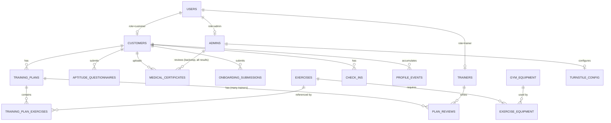

# Data Model

Target: PostgreSQL, defined via Drizzle schema. This document describes entities conceptually; exact Drizzle table/column syntax is an implementation detail derived from this.

## 1. Entity-Relationship Overview

## 2. Tables

### `users`
Base authentication record for all roles.
| Column | Type | Notes |
|---|---|---|
| id | uuid PK | |
| email | text, unique | |
| phone | text | |
| password_hash | text, nullable | Null until aptitude clearance (FR-9); no login possible before it's set |
| role | enum(`customer`,`trainer`,`admin`) | |
| created_at | timestamp | |
| updated_at | timestamp | |

Trainer/admin rows are created only by the seed script (FR-41) — there is no application code path that inserts a `users` row with `role IN ('trainer','admin')` other than that seed.

### `customers`
Role-specific profile, 1:1 with `users` where `role = customer`.
| Column | Type | Notes |
|---|---|---|
| id | uuid PK | |
| user_id | uuid FK → users.id | |
| name | text | |
| birthdate | date | |
| reference_photo_path | text | Server-side only (uploads volume); audit/recompute source, never served to the kiosk or any client |
| reference_face_embedding | jsonb (float array) | The only biometric artifact distributed outward, via the kiosk embeddings endpoint (FR-31) |
| aptitude_status | enum(`pending`,`cleared`,`rejected`) | Final state after the questionnaire/certificate/admin-override flow resolves |
| membership_status | enum(`active`,`inactive`) | Mocked, no billing logic behind it |
| membership_plan | text, nullable | Mocked plan tier label |
| created_at | timestamp | |

### `trainers`
| Column | Type | Notes |
|---|---|---|
| id | uuid PK | |
| user_id | uuid FK → users.id | |
| name | text | |

### `admins`
| Column | Type | Notes |
|---|---|---|
| id | uuid PK | |
| user_id | uuid FK → users.id | |
| name | text | |

### `aptitude_questionnaires`
| Column | Type | Notes |
|---|---|---|
| id | uuid PK | |
| customer_id | uuid FK → customers.id | |
| answers | jsonb | Raw questionnaire responses |
| ai_result | enum(`cleared`,`not_cleared`,`pending_retry`) | `pending_retry` = AI service errored/timed out, not a real evaluation (see 04-architecture.md §4) |
| ai_notes | text | AI's reasoning/flags |
| submitted_at | timestamp | |

### `medical_certificates`
Every row here is routed to the Admin backstop queue regardless of `ai_result` (FR-6) — there is no "only uncertain ones get reviewed" branch.
| Column | Type | Notes |
|---|---|---|
| id | uuid PK | |
| customer_id | uuid FK → customers.id | |
| file_path | text | On the uploads volume |
| ai_result | enum(`cleared`,`not_cleared`,`pending_retry`) | |
| ai_notes | text | |
| admin_reviewed_by | uuid FK → admins.id, nullable | Set once an admin has looked at this row |
| admin_reviewed_at | timestamp, nullable | |
| admin_override_result | enum(`cleared`,`not_cleared`), nullable | Admin's final call — overrides `ai_result` when set; this is the customer's only recovery path from a wrongly-rejected `not_cleared` |
| uploaded_at | timestamp | |

### `onboarding_submissions`
Append-friendly: a customer may add more onboarding info over time (FR-14), not just once.
| Column | Type | Notes |
|---|---|---|
| id | uuid PK | |
| customer_id | uuid FK → customers.id | |
| medications | jsonb | |
| physical_conditions | jsonb | |
| goals | text | "Pretensions" |
| exam_attachment_paths | jsonb (array of strings) | |
| submitted_at | timestamp | |

### `exercises`
Curated library (FR-16) — the AI selects from this, does not invent free-text exercises. **Add-only**: the Admin can create new rows but the app never deletes one, so historical `training_plan_exercises` rows always resolve (FR-24).
| Column | Type | Notes |
|---|---|---|
| id | uuid PK | |
| name | text | |
| muscle_group | text | e.g. "legs", "chest" |
| instructions | text | |
| created_at | timestamp | |

### `gym_equipment`
| Column | Type | Notes |
|---|---|---|
| id | uuid PK | |
| name | text | e.g. "Leg press" |
| is_available | boolean, default true | Toggled by Admin; the only mutable field Admin controls on the equipment side |
| created_at | timestamp | |

### `exercise_equipment`
N:N join between exercises and the equipment that can perform them (FR-17).
| Column | Type | Notes |
|---|---|---|
| exercise_id | uuid FK → exercises.id | Composite PK with `equipment_id` |
| equipment_id | uuid FK → gym_equipment.id | |

Availability rule: an exercise with **zero** rows here requires no equipment (e.g. bodyweight) and is always available. An exercise with **one or more** rows is available if at least one linked `gym_equipment.is_available = true`.

### `training_plans`
One row per customer per date.
| Column | Type | Notes |
|---|---|---|
| id | uuid PK | |
| customer_id | uuid FK → customers.id | |
| plan_date | date | Interpreted in the server's local timezone (FR-39) |
| ai_generated_at | timestamp | |
| status | enum(`ai_published`,`trainer_edited`) | Flips to `trainer_edited` the moment any trainer directly edits the exercise list; used to trigger the regeneration warning (FR-22) |
| last_trainer_edited_by | uuid FK → trainers.id, nullable | Quick reference for the most recent direct edit; full comment/edit history lives in `plan_reviews` |
| last_trainer_edited_at | timestamp, nullable | |

### `plan_reviews`
One row per trainer interaction with a plan — comments and edits alike — so multiple trainers' input is retained rather than overwriting a single column (FR-19).
| Column | Type | Notes |
|---|---|---|
| id | uuid PK | |
| training_plan_id | uuid FK → training_plans.id | |
| trainer_id | uuid FK → trainers.id | |
| note | text | |
| is_edit | boolean | `true` if this entry accompanied a direct edit to the plan's exercises; `false` if it's only a comment |
| created_at | timestamp | |

### `training_plan_exercises`
| Column | Type | Notes |
|---|---|---|
| id | uuid PK | |
| training_plan_id | uuid FK → training_plans.id | |
| exercise_id | uuid FK → exercises.id | |
| sets | integer | |
| reps | integer | |
| load | text, nullable | Weight/resistance, free-form (kg, band level, etc.) |
| order_index | integer | Display order within the plan |
| completed | boolean, default false | Marked by customer |
| notes | text, nullable | |

A retroactive correction (FR-23) updates these rows directly for a past `plan_date` — there is no versioning/history table for this; the corrected state is the historical record.

### `check_ins`
Attendance log from the facial-recognition kiosk flow (FR-30–FR-34). There is no corresponding "checkout" row anywhere in the schema — see occupancy notes below.
| Column | Type | Notes |
|---|---|---|
| id | uuid PK | |
| customer_id | uuid FK → customers.id | |
| checked_in_at | timestamp | |
| turnstile_status | enum(`success`,`failed`) | Whether the external turnstile API call succeeded — independent of whether the check-in itself is recorded (it always is) |
| turnstile_response | jsonb, nullable | Mocked response/error payload from the external API |

### `profile_events`
The durable "AI memory" extracted from chat (FR-27) — **not** a chat transcript table.
| Column | Type | Notes |
|---|---|---|
| id | uuid PK | |
| customer_id | uuid FK → customers.id | |
| event_type | enum(`injury`,`skipped_exercise`,`medication_change`,`life_event`,`state_update`,`plan_adjustment_request`) | |
| payload | jsonb | Structured extracted data, shape depends on `event_type` |
| source_message | text, nullable | Optional raw excerpt kept for traceability/debugging, not for UI replay |
| created_at | timestamp | |

This table is what the AI reads (alongside `onboarding_submissions` and recent `training_plans`) to build context for every new plan generation or chat response — it's the mechanism behind "the AI always knows about the user's current and historical state."

### `turnstile_config`
Singleton row, admin-editable (FR-35).
| Column | Type | Notes |
|---|---|---|
| id | uuid PK | Effectively singleton (one row) |
| base_url | text | |
| api_key | text | Consider encrypting at rest even though mocked |
| field_mapping | jsonb | How local fields map to the external API's expected request shape |
| updated_by | uuid FK → admins.id | |
| updated_at | timestamp | |

### `gym_settings`
Singleton row for gym-wide info shown on the public/logged-in gym info page.
| Column | Type | Notes |
|---|---|---|
| id | uuid PK | |
| opening_hours | jsonb | Used to compute "is the gym open," in the server's local timezone (FR-39) |

## 3. Derived / Computed Data (not stored redundantly)

These are queries, not tables:

- **Personal metrics** (FR-36): training frequency, days trained, exercise breakdown, training volume — computed by joining `check_ins` and `training_plan_exercises`/`training_plans` for a given customer. Reflects the corrected record where retroactive edits were made (FR-23).
- **Current occupancy** (FR-37): `COUNT(*) FROM check_ins WHERE checked_in_at >= now() - interval '90 minutes'` (window is a tunable constant, not user-configurable) — an estimate, since there is no checkout event.
- **Gym-wide equipment/muscle-group demand** (FR-38): aggregating today's `check_ins` joined to `training_plans`/`training_plan_exercises`/`exercises`, filtered to exercises currently available per the `exercise_equipment` → `gym_equipment.is_available` rule.

## 4. Seed Data

A first-boot seed script (see [04-architecture.md](./04-architecture.md) §8) creates:
- Fixed demo `trainer` and `admin` accounts with known credentials (the only way these roles come into existence — FR-41).
- An initial `exercises` / `gym_equipment` / `exercise_equipment` catalog.
- A batch of fake seeded customers, `check_ins`, and `training_plans` so occupancy and equipment-demand queries return meaningful results for a demo.
