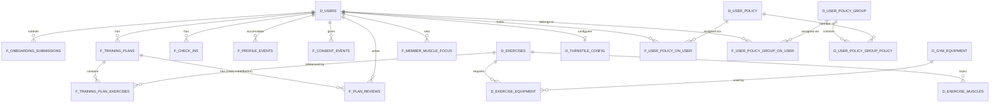

# Data Model

Target: PostgreSQL, defined via Drizzle schema. This document describes entities conceptually; exact Drizzle table/column syntax is an implementation detail derived from this.

Tables follow a fact/dimension prefix convention: **`d_`** for dimension tables (relatively static reference/master data describing a *who* or *what*) and **`f_`** for fact tables (events, transactions, or measurable occurrences, each tied to a point in time). See `rules/naming-conventions.md`. This is a distinction of **grain and change-frequency, not mutability** - a fact row can be (and sometimes is) updated in place; it just tends to change or accumulate far more often than a dimension row does.

## 1. Entity-Relationship Overview

```mermaid
erDiagram
    D_USERS ||--o{ F_ONBOARDING_SUBMISSIONS : submits
    D_USERS ||--o{ F_TRAINING_PLANS : has
    D_USERS ||--o{ F_CHECK_INS : has
    D_USERS ||--o{ F_PROFILE_EVENTS : accumulates
    D_USERS ||--o{ F_CONSENT_EVENTS : gives
    F_TRAINING_PLANS ||--o{ F_TRAINING_PLAN_EXERCISES : contains
    F_TRAINING_PLANS ||--o{ F_PLAN_REVIEWS : "has (many contributors)"
    D_USERS ||--o{ F_PLAN_REVIEWS : writes
    D_EXERCISES ||--o{ F_TRAINING_PLAN_EXERCISES : "referenced by"
    D_EXERCISES ||--o{ D_EXERCISE_EQUIPMENT : requires
    D_EXERCISES ||--o{ D_EXERCISE_MUSCLES : trains
    D_USERS ||--o{ F_MEMBER_MUSCLE_FOCUS : sets
    D_GYM_EQUIPMENT ||--o{ D_EXERCISE_EQUIPMENT : "used by"
    D_USERS ||--o| D_TURNSTILE_CONFIG : configures
    D_USERS ||--o{ F_USER_POLICY_ON_USER : holds
    D_USER_POLICY ||--o{ F_USER_POLICY_ON_USER : "assigned via"
    D_USERS ||--o{ F_USER_POLICY_GROUP_ON_USER : "belongs to"
    D_USER_POLICY_GROUP ||--o{ F_USER_POLICY_GROUP_ON_USER : "assigned via"
    D_USER_POLICY_GROUP ||--o{ D_USER_POLICY_GROUP_POLICY : contains
    D_USER_POLICY ||--o{ D_USER_POLICY_GROUP_POLICY : "member of"
```

## 2. Tables

### `d_users`
Single table for every person in the system - member, trainer, or admin alike. There is **no `role` column and no separate per-role profile table**; what a user can do is entirely determined by their active policy grants and group memberships (`f_user_policy_on_user` → `d_user_policy`, and `f_user_policy_group_on_user` → `d_user_policy_group` → `d_user_policy`, see below), and which of the columns below are populated depends on what kind of person they are (see notes per column). The members are the users with a membership status. There are no applicants in the data: a person who has not finished registration (FR-1, FR-57) has no row, and accepting a person as a member happens at the physical gym, off-system, leaving no record here.
| Column | Type | Notes |
|---|---|---|
| id | uuid PK | |
| email | text, unique | A row is created only when registration completes (FR-9), in one request with the consent, the reference photo and the password. A registered e-mail is refused at that point; there is no rejected or blocked state |
| phone | text, nullable | |
| password_hash | text | Set at registration (FR-9), at least 8 characters before hashing; a member can log in as soon as the account exists |
| name | text | |
| birthdate | date, nullable | Only ever populated for a member |
| gender | enum(`female`,`male`,`prefer_not_to_say`), nullable | Optional (FR-45); only ever populated for a member who chose to answer |
| reference_photo_path | text, nullable | Server-side only (uploads volume); audit/recompute source, never served to the kiosk or any client. Only ever populated for a member |
| reference_face_embedding | jsonb (float array), nullable | The only biometric artifact distributed outward, via the kiosk embeddings endpoint (FR-31). Only ever populated for a member |
| membership_status | enum(`active`,`inactive`), nullable | Mocked, no billing logic behind it. Only ever populated for a member; set to `active` when registration completes. `inactive` means the member cannot log in (an existing session stops working) and cannot check in at the kiosk: no turnstile call is made and no check-in row is written (FR-40, RN-15). An admin switches it, for example when a member who stopped paying comes back and pays at the desk (FR-40) |
| membership_plan | text, nullable | Mocked plan tier label. Only ever populated for a member |
| created_at | timestamp | |
| updated_at | timestamp | |

Trainer/admin rows are created only by the seed script (FR-41) - there is no application code path that inserts a `d_users` row and gives it staff-designated policies or groups other than that seed, or the Admin policy-management feature (FR-43) acting on an *existing* row.

### `f_consent_events`
Records each LGPD consent a member has given (FR-46, RN-12). It is sent with the final registration request and written in the same transaction that creates the account, before the embedding is computed, so a rejected reference photo rolls both back. Append-only: a new consent (a re-worded
policy, for example) is a new row, never an edit to an old one - the point is to be able to prove what
was agreed to and when, not just what is true now.
| Column | Type | Notes |
|---|---|---|
| id | uuid PK | |
| user_id | uuid FK → d_users.id | |
| consent_type | text | e.g. `biometric_facial` - the only type this project defines today |
| consent_version | text | Identifies which wording of the consent text was shown |
| consented_at | timestamp | |

### `d_user_policy`
One row per granular, independently-grantable permission - the building block CASL abilities are constructed from. **Add-mostly**: policies are seeded/added over time; an existing one shouldn't be deleted once any `f_user_policy_on_user` or `d_user_policy_group_policy` row references it, for the same reason `d_exercises` is add-only.
| Column | Type | Notes |
|---|---|---|
| id | text PK | Human-readable slug matching the policy's purpose, e.g. `manage_own_onboarding`, `read_checkins` - not a random uuid, since it's referenced directly as a stable identifier in code (`packages/shared/src/auth/constants/policies.ts`) |
| description | text | Human-readable explanation, shown in the Admin policy screen (FR-43) |
| operation | text | CASL action: `create` \| `read` \| `update` \| `delete` \| `manage` |
| resource | text | CASL subject type the operation applies to, e.g. `TrainingPlan`, `Member`, `CheckIn`, `Catalog`, `UserPolicyAssignment`, `MemberApp`, `StaffApp` |
| scope | text | `self` \| `all` - whether the operation applies only to the acting user's own records, or to any record of that resource type |
| created_at | timestamp | |

`operation`/`resource`/`scope` are plain `text`, not Postgres enums - the value vocabulary is owned by the shared TS types in `packages/shared/src/auth/types.ts`, not the database, so adding a policy that recombines existing actions/resources is a seed insert, never a migration.

### `f_user_policy_on_user`
The assignment of a policy to a user. A user's effective permissions are the union of every non-expired row here, so a user can hold any number of policies at once.
| Column | Type | Notes |
|---|---|---|
| user_id | uuid FK → d_users.id | Composite PK with `policy_id` |
| policy_id | text FK → d_user_policy.id | |
| effect | enum(`granted`,`denied`) | A `denied` row is a targeted override that takes precedence over a `granted` row the user would otherwise hold - mirrors CASL's `cannot()`/inverted rules |
| expires_on | timestamp, nullable | `NULL` = indefinite. This is a **mutable** fact row, not an append-only event log: revoking a grant means updating `expires_on` on the existing row, not inserting a new one - same idea as `f_training_plan_exercises`'s retroactive corrections |

### `d_user_policy_group`
A named bundle of policies, so an Admin can tell at a glance who is a member, a trainer or an admin without reading dozens of individual grants (FR-47). **Seeded and read-only**: no procedure creates, edits or deletes one, and the seed owns the contents. Add-mostly, like `d_user_policy`: never delete a group once any `f_user_policy_group_on_user` row references it.
| Column | Type | Notes |
|---|---|---|
| id | text PK | Human-readable slug, e.g. `member`, `trainer`, `admin` - referenced directly as a stable identifier in code (`packages/shared/src/auth/constants/policies.ts`), same exception to the uuid rule as `d_user_policy.id`. The Admin policy screen shows it capitalized (`Member`, `Trainer`, `Admin`) |
| description | text | Short human-readable explanation of who the group is for |
| created_at | timestamp | |

### `d_user_policy_group_policy`
The N:N bridge between two dimensions: which policies a group contains. Seeded alongside the groups and re-asserted by every seed run, so a change to a group's policy list in code reaches every current member.
| Column | Type | Notes |
|---|---|---|
| group_id | text FK → d_user_policy_group.id | Composite PK with `policy_id` |
| policy_id | text FK → d_user_policy.id | |

The seeded composition of the three groups (the source is `packages/shared/src/auth/constants/policies.ts`):

| Group | Policies |
|---|---|
| `member` | `read_member_app`, `manage_own_onboarding`, `read_own_plans`, `update_own_plans`, `use_chat`, `manage_own_profile_events`, `read_own_metrics`, `read_catalog`, `read_gym_info` |
| `trainer` | `read_staff_app`, `read_all_plans`, `update_all_plans`, `manage_plan_reviews`, `read_members`, `read_catalog`, `read_gym_info` |
| `admin` | `read_staff_app`, `manage_catalog`, `manage_turnstile_config`, `manage_policy_assignments`, `read_members`, `manage_memberships`, `manage_gym_settings`, `read_all_plans`, `read_checkins`, `read_catalog`, `read_gym_info` |

`manage_own_profile_events` (manage `ProfileEvent`, scope `self`) lets a member see the facts the AI remembers and mark them resolved (FR-58). `manage_memberships` (update `Member`) switches a membership between active and inactive (FR-40), and `manage_gym_settings` (manage `GymSettings`) edits the opening hours (FR-62). `read_members` (read `Member`) is held by trainers as well as admins, for the member list and the member page (FR-60), and `read_checkins` (read `CheckIn`) opens the check-in log and the per-hour check-in counts (FR-61, FR-37). There is no policy for medical certificates or aptitude: accepting a member is not a function of this system.

### `f_user_policy_group_on_user`
The assignment of a group to a user. Belonging to a group has exactly the effect of holding every policy in it as a `granted` row, for as long as the membership is active.
| Column | Type | Notes |
|---|---|---|
| user_id | uuid FK → d_users.id | Composite PK with `group_id` |
| group_id | text FK → d_user_policy_group.id | |
| expires_on | timestamp, nullable | `NULL` = indefinite. Mutable in place, exactly like `f_user_policy_on_user`: removing a user from a group means updating `expires_on`, never deleting the row |

There is no `effect` column: a group only ever grants. Taking one policy away from a user who gets it through a group is done with a direct `f_user_policy_on_user` row whose `effect` is `denied`, never by editing the group.

Building a CASL ability for a user: take the union of (a) every `f_user_policy_on_user` row where `expires_on IS NULL OR expires_on > now()`, and (b) every policy of every group the user belongs to through an `f_user_policy_group_on_user` row where `expires_on IS NULL OR expires_on > now()` (via `d_user_policy_group_policy`), each of these treated as `granted`. Join to `d_user_policy`, and map each to a CASL rule `{ action: operation, subject: resource, conditions: scope === 'self' ? { userId: user.id } : undefined, inverted: effect === 'denied' }`. A `denied` direct row wins over a `granted` policy that arrives through a group (RN-10). See `docs/04-architecture.md` §11 for where this happens in the request lifecycle.

### `f_onboarding_submissions`
Append-friendly: a member may add more onboarding info over time (FR-14), not just once. Onboarding is required after the first login (FR-11), and the newest submission is the member's current profile: the AI reads it as the current truth and the member's update form is prefilled from it.
| Column | Type | Notes |
|---|---|---|
| id | uuid PK | |
| user_id | uuid FK → d_users.id | |
| height_cm | integer | Required (FR-12) |
| weight_kg | numeric, one decimal | Required (FR-12) |
| medications | jsonb | Validated by a zod schema; "none" is valid |
| physical_conditions | jsonb | Validated by a zod schema: the list of conditions or limitations plus `otherNotes`, the free-form notes, which live inside this column rather than in a column of their own |
| goals | text | "Pretensions" |
| exams | jsonb (array of entries) | Medical exams as structured entries validated by a zod schema: each has a `name`, an optional `date`, a `findings` summary typed by the member, and an optional attachment path (the file lives on the uploads volume). An empty list is valid ("none") |
| submitted_at | timestamp | |

The AI module carries text only, so the AI reads the typed findings of each exam. An attached file is optional supporting evidence for staff and is never read by the AI.

### `d_exercises`
Curated library (FR-16) - the AI selects from this, does not invent free-text exercises. **Add-only**: new rows can be created but the app never deletes one, so historical `f_training_plan_exercises` rows always resolve (FR-24).
| Column | Type | Notes |
|---|---|---|
| id | uuid PK | |
| name | text | |
| instructions | text | |
| created_at | timestamp | |

The muscles an exercise trains live in `d_exercise_muscles` below; there is no free-text muscle group column. Migration `0010` drops the old `muscle_group` column and creates the muscle tables, so an existing local database should run `pnpm db:reset`. Re-running the seed also works for the seeded exercises: it fills in the muscle map of any seeded exercise that has none, while an exercise added by hand needs its muscles tagged again.

### `d_exercise_muscles`
The muscle map of an exercise (FR-16, FR-49): which of the 22 fixed muscles it trains, and how. Part of the add-only catalog: rows are written when the exercise is created and never edited afterward (FR-24).
| Column | Type | Notes |
|---|---|---|
| exercise_id | uuid FK → d_exercises.id | Composite PK with `muscle` |
| muscle | enum `muscle` | `neck`, `chest`, `front-deltoid`, `lateral-deltoid`, `rear-deltoid`, `biceps`, `triceps`, `forearm-flexors`, `forearm-extensors`, `abs`, `abs-lower`, `obliques`, `trapezius`, `rotator-cuff`, `lats`, `lower-back`, `glutes`, `abductors`, `quads`, `quads-outer`, `hamstrings`, `calves`. The vocabulary is owned by `packages/shared/src/schemas/muscles.ts`, which also holds each muscle's label and the body view or views it is drawn on. Left and right are never stored: a muscle is one value |
| role | enum `muscle_role` | `primary` or `secondary`. A primary muscle weighs 1 and a secondary one 0.5 when work is summed |

Every exercise has at least one `primary` row, enforced by the shared zod schema on creation. A muscle appears at most once per exercise (the composite key).

### `d_gym_equipment`
| Column | Type | Notes |
|---|---|---|
| id | uuid PK | |
| name | text | e.g. "Leg press" |
| is_available | boolean, default true | Set to an explicit value (not flipped) by whoever holds the catalog-management permission (FR-24); `false` is shown to users as "Out of service". The only mutable field of the row itself |
| created_at | timestamp | |

### `d_exercise_equipment`
N:N join between exercises and the equipment that can perform them (FR-17). Whoever holds the catalog-management permission can replace an equipment item's set of linked exercises (FR-24).
| Column | Type | Notes |
|---|---|---|
| exercise_id | uuid FK → d_exercises.id | Composite PK with `equipment_id` |
| equipment_id | uuid FK → d_gym_equipment.id | |

Availability rule: an exercise with **zero** rows here requires no equipment (e.g. bodyweight) and is always available. An exercise with **one or more** rows is available if at least one linked `d_gym_equipment.is_available = true`. Removing an exercise's last link therefore makes it count as needing no equipment, which the editing screen warns about.

### `f_training_plans`
One row per member per date.
| Column | Type | Notes |
|---|---|---|
| id | uuid PK | |
| user_id | uuid FK → d_users.id | The member the plan is for |
| plan_date | date | Interpreted in the server's local timezone (FR-39). A plan dated before today is history: a trainer cannot edit it and it is no longer re-filtered by equipment availability (RN-17) |
| ai_generated_at | timestamp | |
| status | enum(`ai_published`,`trainer_edited`) | Flips to `trainer_edited` the moment anyone with the plan-edit permission directly edits the exercise list; one of the two reasons (`trainer_edited`, `has_completed`) that trigger the regeneration confirmation (FR-22) |
| last_edited_by_user_id | uuid FK → d_users.id, nullable | Quick reference for the most recent direct edit; full comment/edit history lives in `f_plan_reviews` |
| last_edited_at | timestamp, nullable | |

### `f_plan_reviews`
One row per contributor interaction with a plan - comments and edits alike - so multiple contributors' input is retained rather than overwriting a single column (FR-19). Each row is readable by any staff member and by the member the plan belongs to, and the AI uses a member's latest ones as guidance when it builds or rebuilds that member's plans.
| Column | Type | Notes |
|---|---|---|
| id | uuid PK | |
| training_plan_id | uuid FK → f_training_plans.id | |
| user_id | uuid FK → d_users.id | Whoever wrote this note/edit |
| note | text | |
| is_edit | boolean | `true` if this entry accompanied a direct edit to the plan's exercises; `false` if it's only a comment |
| created_at | timestamp | |

### `f_training_plan_exercises`
| Column | Type | Notes |
|---|---|---|
| id | uuid PK | |
| training_plan_id | uuid FK → f_training_plans.id | |
| exercise_id | uuid FK → d_exercises.id | |
| sets | integer | |
| reps | integer | |
| load | text, nullable | Weight/resistance, free-form (kg, band level, etc.) |
| order_index | integer | Display order within the plan |
| completed | boolean, default false | Marked by the member. Never silently lost: regenerating or trainer-editing a plan keeps `completed` for each exercise that remains in it, matched by exercise (RN-16) |
| notes | text, nullable | |

A retroactive correction (FR-23) updates these rows directly for a past `plan_date` - there is no versioning/history table for this; the corrected state is the historical record. A past plan is history in the other direction too: a trainer cannot edit it, and it is not re-filtered when equipment goes down later (RN-17).

### `f_check_ins`
Attendance log from the facial-recognition kiosk flow (FR-30 to FR-34). There is no corresponding "checkout" row anywhere in the schema - see occupancy notes below.
| Column | Type | Notes |
|---|---|---|
| id | uuid PK | |
| user_id | uuid FK → d_users.id | |
| checked_in_at | timestamp | |
| turnstile_status | enum(`success`,`failed`) | Whether the external turnstile API call succeeded - independent of whether the check-in itself is recorded (it always is, once the member passes the active-membership check). A technical failure is its own value, `failed`, never a real access decision |
| turnstile_response | jsonb, nullable | What the external API answered, as `{ response: { httpStatus, body } }`, plus an `error` code on a failure: `not_configured` (no turnstile URL saved), `timeout`, `http_error` (the API answered with an error status) or `network_error` (it could not be reached). A row with no recognized code, such as one written before the code existed, reads as `unknown`. The staff check-in log shows only this reason, never the stored payload (FR-61) |

A member whose membership is `inactive` is refused before the turnstile is called, so no row is written for that attempt (RN-15).

### `f_profile_events`
The durable "AI memory" extracted from chat (FR-27) - **not** a chat transcript table.
| Column | Type | Notes |
|---|---|---|
| id | uuid PK | |
| user_id | uuid FK → d_users.id | |
| event_type | enum(`injury`,`skipped_exercise`,`medication_change`,`life_event`,`state_update`,`plan_adjustment_request`,`muscle_focus_changed`) | `muscle_focus_changed` is written by the focus module (FR-51), never extracted from chat |
| payload | jsonb | Structured extracted data, shape depends on `event_type`. For `muscle_focus_changed`: `{ description, muscle, from, to }`, the levels before and after |
| source_message | text, nullable | Optional raw excerpt kept for traceability/debugging, not for UI replay |
| created_at | timestamp | |
| resolved_at | timestamptz, nullable | Set when the member marks the fact "no longer true" (an injury that healed); cleared again by "applies again" (FR-58). A resolved fact stays as history but is skipped by every prompt |

This table is what the AI reads (alongside `f_onboarding_submissions` and recent `f_training_plans`) to build context for every new plan generation or chat response - it's the mechanism behind "the AI always knows about the user's current and historical state." The `muscle_focus_changed` rows are kept as history but left out of those prompts: the current levels in `f_member_muscle_focus` are read instead, and resolved rows are left out too. Injuries and medication changes that are still unresolved are always given to the AI in detail, however old, and are never folded into an "older events" count. The member sees every row on the Health profile page, grouped by type with the date and their own words (FR-58), and trainers see the unresolved ones beside a plan (FR-60).

### `f_member_muscle_focus`
A member's current emphasis per muscle (FR-51). A fact table in the sense of `rules/naming-conventions.md`: it records what the member chose, and a row is updated in place rather than versioned (the history is the `muscle_focus_changed` events above).
| Column | Type | Notes |
|---|---|---|
| user_id | uuid FK → d_users.id | Composite PK with `muscle` |
| muscle | enum `muscle` | The same 22 values as `d_exercise_muscles.muscle` |
| bias | smallint | -2 (much less), -1, 1, or 2 (much more); validated to the range -2 to 2 by the shared zod schema |
| updated_at | timestamp | |

A missing row means normal (0): setting a muscle back to normal deletes its row, so the table only ever holds the muscles the member has an opinion about.

### `d_turnstile_config`
Singleton row, editable by whoever holds the turnstile-config permission (FR-35).
| Column | Type | Notes |
|---|---|---|
| id | uuid PK | Singleton: always the fixed id `00000000-0000-4000-8000-000000000001`, created empty on first read |
| method | enum(`GET`,`POST`,`PUT`) | HTTP method of the unlock request |
| url | text | Full address of the unlock request, including path and any query string. Empty until configured |
| headers | jsonb | List of `{ name, value, secret }`, validated by a zod schema. Secret values are masked on read. Consider encrypting secrets at rest even though mocked |
| body_template | text | Optional request body (JSON, XML, any text) with `{{memberId}}` and `{{timestamp}}` placeholders; ignored for GET |
| updated_by_user_id | uuid FK → d_users.id, nullable | Null until an admin first saves the config |
| updated_at | timestamp | |

### `d_gym_settings`
Singleton row for gym-wide info shown on the public gym info page. Its opening hours are edited by whoever holds the gym-settings permission (FR-62).
| Column | Type | Notes |
|---|---|---|
| id | uuid PK | Singleton: always the fixed id `00000000-0000-4000-8000-000000000002`, created with the defaults on first read |
| opening_hours | jsonb | One entry per weekday (`sunday` to `saturday`), each `{ open, close }` in 24-hour `HH:MM` with `open` before `close`, or `null` for a closed day; validated by a zod schema in `packages/shared`. Used to compute "is the gym open" and the next opening or closing time, in the server's local timezone (FR-39). Default: Monday to Friday 06:00-22:00, Saturday 08:00-14:00, Sunday closed. Open is `[open, close)`: the closing minute itself is already closed |

## 3. Derived / Computed Data (not stored redundantly)

These are queries, not tables:

- **Personal metrics** (FR-36): training frequency/days trained counts distinct calendar days with a row in `f_check_ins` for that member - physical check-in only, not exercise completion. Exercise breakdown and training volume come from `f_training_plan_exercises`/`f_training_plans` instead, and the muscle heat map is the weighted load of the completed exercises in the range (sets times the muscle's role weight, from `d_exercise_muscles`). Reflects the corrected record where retroactive edits were made (FR-23).
- **Plan muscle load** (FR-50): for one plan, the sum over its exercises of `sets` times the role weight (primary 1, secondary 0.5) for each muscle the exercise trains. Only exercises that are performable right now (the FR-17 rule) count. The same weighting feeds the AI's "top muscles today" aggregate and the heat steps, which scale each muscle against the busiest one in the view.
- **Catalog coverage** (FR-52): per muscle, the exercises in `d_exercise_muscles` that train it, how many of them are available now, and how many are lost, plus for each unavailable equipment item the exercises it takes out (unavailable, with that item unavailable) and the muscles they train. Computed in the browser from the catalog list with the shared functions.
- **Must-review plan** (FR-53, RN-14): a row of `f_training_plans` whose `plan_date` is today or later and that has at least one `f_training_plan_exercises` row whose exercise fails the FR-17 rule (it has linked equipment and none of it is available). Evaluated on every read, never stored: there is no flag column and no acknowledged state, so it clears when the plan's exercises change or the equipment's `is_available` is switched back on. A plan dated before today is never flagged.
- **Plan review comparison** (FR-54): the member's weighted muscle load from the `completed` exercises of their plans in the 14 days before the plan's `plan_date` (the plan's own day excluded), and their current rows of `f_member_muscle_focus`. The load of the plan itself is computed in the browser from the exercises being edited.
- **Today's demand** (FR-29, FR-56): for today's `f_training_plans` (every member, not only those checked in), everything counted in distinct plans, never exercise rows or sets. Muscle half: how many plans train each muscle through an exercise that can be done now, and how many of those belong to a member with a row in `f_check_ins` today ("Already checked in"). Equipment half: for each `d_gym_equipment` piece, "Plans" (today's plans that need it) and "In the gym" (how many of those plans belong to members who have checked in today); a plan counts toward a piece that is out of service only through an exercise that has no working alternative left, and a plan counts toward a working piece only through an exercise that can be done on it. The pieces are ordered out-of-service first, then by plan count. This is staff-only and is read from the staff Overview; the public gym info page carries no demand.
- **Plan demand given to the AI** (FR-15): when a plan is built or rebuilt, the other members' plans for the same `plan_date`, counted in plans per equipment piece, plus their muscle load, so broad goals are spread across different equipment and overloaded equipment is avoided. Safety, injuries, medication, exams and muscle focus always win over it.
- **Trainer activity** (FR-56): the distinct plans a trainer touched in the last 7 days, either through an `f_plan_reviews` row created in the window (a note or an edit) or through a `trainer_edited` plan whose `last_edited_at` falls in the window, plus the most recent `f_plan_reviews` row. The window is a constant and is stated on screen.
- **Turnstile health** (FR-56, FR-61): for today's `f_check_ins`, the number with `turnstile_status = 'failed'` out of the total, and whether `d_turnstile_config.url` is set ("not configured" when it is empty). The check-in log lists the most recent rows with the member's name, time, result and the failure reason read from `turnstile_response`.
- **Equipment impact** (FR-24): for one equipment piece, how many `f_training_plans` dated today or later would become must-review if it were switched off (a plan holding an exercise whose only working equipment is that piece), and how many distinct members they belong to; shown in the confirmation before the piece is switched off. Plans dated before today are never counted.
- **Member week** (FR-55): the local calendar days of a range with a row in `f_check_ins` for the member, and the latest `checked_in_at` in the range; the same rule as days trained (FR-36).
- **Member page** (FR-60): for one member, the profile and membership from `d_users`, the newest `f_onboarding_submissions` row as the current health profile, every `f_profile_events` row (resolved ones included, shown muted), the member's `f_training_plans` of the last 60 days (date, status, completed exercises out of the total, notes count, link to the review), and the member's last 30 local calendar days with a row in `f_check_ins`.
- **Current occupancy** (FR-37): `COUNT(DISTINCT user_id) FROM f_check_ins WHERE checked_in_at >= now() - interval '90 minutes'` (window is a tunable constant, not user-configurable) - an estimate, since there is no checkout event, and distinct so a member who scans again is still one person in the gym.
- **Check-ins per hour** (FR-37): for today's `f_check_ins`, the distinct members per local hour, for anyone with the read-check-ins permission. Whatever the turnstile did, the member was physically there.
- **A user's effective permissions** (FR-42): every non-expired `f_user_policy_on_user` row for that user plus every policy of each non-expired group membership (`f_user_policy_group_on_user` → `d_user_policy_group_policy`), joined to `d_user_policy`, translated into CASL rules (see `f_user_policy_on_user`/`f_user_policy_group_on_user` above).
- **Where a user's policy comes from** (FR-48): for each effective policy, the groups that supply it and whether a direct row also exists; this is what the Admin policy screen labels "via Admin group" or "direct".

## 4. Seed Data

A first-boot seed script (see [04-architecture.md](./04-architecture.md) §8) creates:
- The full set of `d_user_policy` rows the app needs (one per operation+resource+scope combination).
- The three `d_user_policy_group` rows (`member`, `trainer`, `admin`) and their `d_user_policy_group_policy` contents (FR-47).
- Fixed demo trainer and admin `d_users` rows with known credentials, each given the `trainer` or `admin` group through an `f_user_policy_group_on_user` row (the only way these accounts and their access come into existence - FR-41/FR-42/FR-43).
- A fixed demo member `d_users` row (`student@example.com`), with registration already complete (`membership_status` active, a mock `membership_plan`), a stored reference photo and its embedding, in the `member` group.
- An initial `d_exercises` / `d_gym_equipment` / `d_exercise_equipment` / `d_exercise_muscles` catalog, with a muscle map for every exercise. Neck, rotator cuff and forearm extensors are left untrained on purpose, so the staff coverage map has real gaps to show.
- A batch of fake seeded members (`d_users` rows plus their `member` group membership), `f_check_ins`, and `f_training_plans` so occupancy and today's-demand queries return meaningful results for a demo. Every fake member has completed registration (there are no applicants), some are lapsed (`membership_status` inactive, with no check-ins for about 10 days), and fake `f_profile_events` (one resolved) and trainer notes in `f_plan_reviews` exist too.
